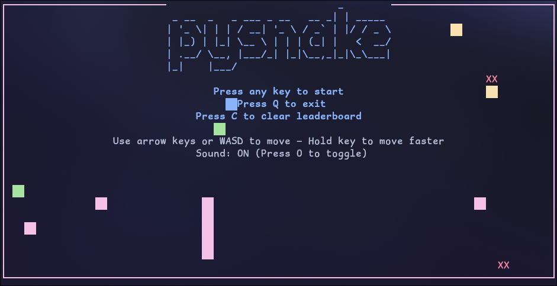

# 🐍 Terminal Snake Game

A colorful, interactive Snake game written in Python using the `curses` module. Features dynamic difficulty, sound effects, a persistent leaderboard, and a retro-style animated title screen.

## 🧩 Features

- Smooth snake movement using arrow keys or WASD
- Speed boost by holding a direction key
- Pausing with `P`, quitting with `Q` or `Esc`
- Dynamic difficulty:
  - Increasing apple count with score
  - Obstacles appear as your score increases
- Colorful randomized apples, snake, and borders
- Sound effects (toggle with `O`)
- Leaderboard saved to `leaderboard.txt`
- Animated demo snake on title screen
- Optional leaderboard wipe with `C` on the title screen

## 📦 Requirements

- Python 3.6+
- `figlet` with the `standard.flf` font
- `paplay` (PulseAudio utility for sound)

## 🛠️ Building

- Install pyinstaller and run this from the root folder. The binary will be in the dist folder when complte. <pre> ```pyinstaller --onefile --add-data "leaderboard.txt:." pysnake.py ``` </pre>
